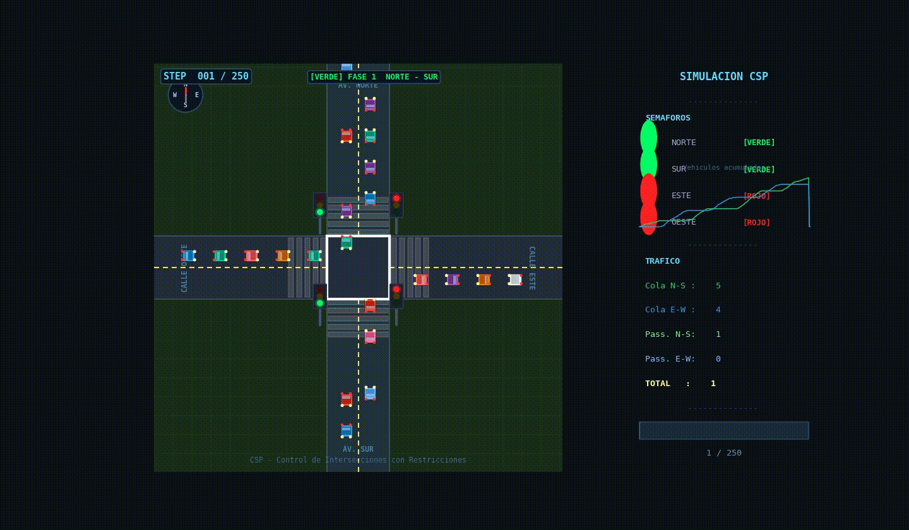

# TC2032 | Design of Intelligent Agents

### By: Laurie Hernández

This repository contains all projects carried out on the class of **Design of Intelligent Agents**, a course focused on understanding of the funcioning of agents, their definition and interactions, as well as understanding different types of environments. 

Throughout the course, several concepts from artificial intelligence and agent-based systems are explored, including the design, modeling, and evaluation of agents in different scenarios.Some of the main topics covered in this repository include:

- Definition and properties of intelligent agents
- Types of environments (deterministic, stochastic, observable, etc.)
- Agent architectures
- Problem solving and search strategies
- Knowledge representation
- Constraint satisfaction problems
- Simulation of agent behavior in different environments
- Visual simulations

## Repository Structure

```
TC2032-DesignOfIntelligentAgents/
│
├── Homework1_Vacuum_Agent/        # Homework regarding the modelling of a Vacuum Agent using heuristics
├── FinalProject_Team4/            # Project involving a traffic light simulation in a multiagent system 
├── ExtraPointsAct/                # Extra points activity involving the modelling of an agent using CSP 
├── requirements.txt/              # All required libraries to work on this repository
└── README.md

```
### 1. Vacuum agent simulation
Based on the trending AI vacuums that automatically clean the floor without crashing and in a short time span, this vacuum agent adapts to a square room, identifying the closest dirty cell and cleaning it, while simulating a deterministic environment where every $n$ steps, a random cell gets dirty. This project can be found at `Homework1_Vacuum_Agent`. 

### 2. Automatic traffic light simulation
Based on data regarding car flow of a real intersection in Monterrey, Nuevo León, an automatic traffic light was designed in order to improve traffic flow, avoiding long waiting lines of cars trying to reach their destination. This project can be found at `FinalProject_Team4`. 

### 3. CSP implementation on a traffic light
CSP was implemented on an intersection where five restrictions were defined. The total number of combinations was counted based off recursive backtracking, allowing the identification of valid states, which then was simulated visually, with high attention to detail. Graphics were made to analyze traffic flow with the traffic light and how it altered vehicles. This project can be found at `ExtraPointsAct`.

## Technologies used
The main tools used throughout the course include: 
- Python
- Jupyter Notebook
- Constraint modeling and heuristics
- Simulation Environments

## Purpose of the repository
The main purpose of this repository is to document the completed work throughout the course, as well as provide different agent model implementations, as well as explore concepts related to artificial intelligence and autonomous decision-making. 

## Demonstration Video
The following video includes an example of a CSP Traffic Simulation carried out in Python, using libraries such as `Matplotlib` and `Numpy` to improve visuals for the user, as well as the implementation of recursive backtracking to identify the total number of possible combinations for valid scenarios on the simulation. 

